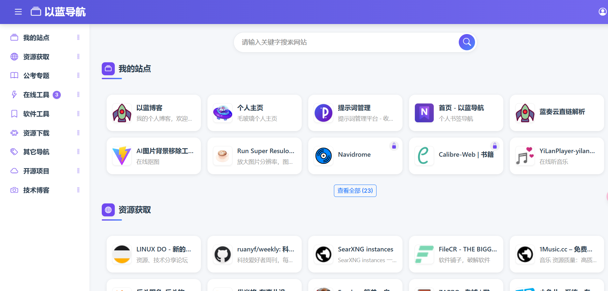
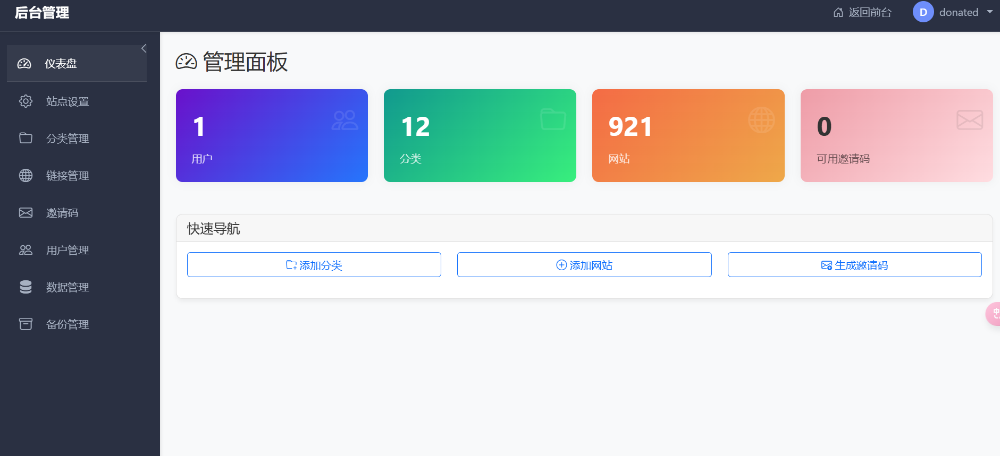
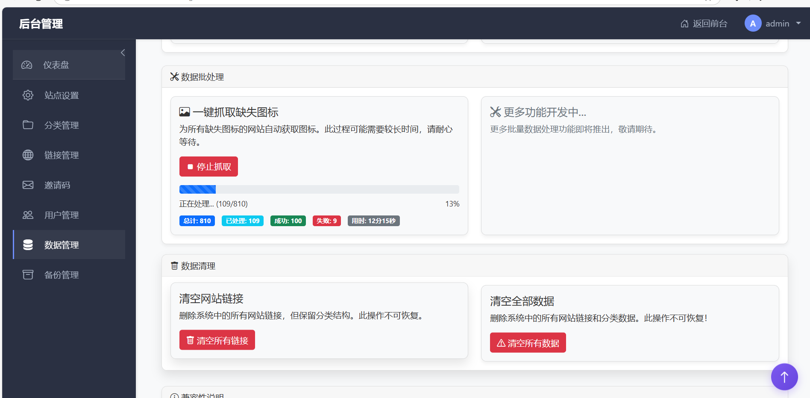

# BookNav - 高度可定制的个人导航网站

BookNav 是一个使用 Flask 构建的、可通过 Docker 轻松部署的个人导航网站项目。它旨在帮助用户整理和快速访问常用的网站链接，提供分类管理和丰富的交互功能，并支持邀请码注册系统来控制用户访问。







抓取图标功能线上点击抓取后可能存在不显示进度问题，可以本地运行抓取图标然后导出数据库，再导入线上

## ✨ 特色功能

BookNav 基于 Flask Web 框架打造，提供了以下核心功能：

### 🧰 交互增强功能

- **🖱️ 右键菜单交互**: 链接卡片右键可弹出快捷菜单，支持添加、编辑、删除、复制链接等操作
- **⚡ 快速添加网站**: 首页直接粘贴链接可弹出快速添加链接对话框，无需进入后台
- **🤏 拖拽排序功能**:
  - 支持网站卡片拖拽排序
  - 支持侧边栏分类拖拽排序
- **🔄 重复链接验证功能**:
  - 在添加或编辑网站时自动检测 URL 是否已存在
  - 智能提示已存在的链接及其所属分类
  - 提供选项: 取消添加、强制添加或跳转到已有链接
  - 有效防止重复添加相同网站，保持导航整洁

### 🔍 高效搜索系统

- **全局快速搜索**: 顶部搜索框支持即时搜索整站内容
- **多维度匹配**:支持网站标题、URL、描述和关键词的全文搜索
- **分类内搜索**: 在特定分类页面可限定搜索范围

### **📤 数据库导入导出功能**:

- 完美兼容 OneNav 数据结构，支持无缝迁移
- 支持导入 OneNav 的 SQLite 数据库导出文件
- 自动匹配分类，保留原有的组织结构
- 导出为多种格式：原生格式、OneNav 兼容格式

### ⚙️ 后台管理系统

- **完整的后台管理界面**: 独立的管理控制台
- **网站与分类管理**: 完整的增删改查功能，批量删除，批量修改公开，私有状态
- **站点设置**: 自定义站点名称、Logo、SEO 信息等，支持自定义背景图片，支持开启链接跳转过渡页（支持放广告）
- **邀请码管理**: 生成和管理注册邀请码
- **数据批量操作功能**：
  - 一键抓取图标
  - 一键清空所有数据
  - 备份功能

### 🔐 用户系统

- **用户管理**: 首次启动默认超级管理员权限，支持查看和管理用户账户，支持添加普通用户和管理员角色

* **邀请码注册**: 仅通过邀请码才能注册新用户，确保站点的私密性
* **用户认证**: 完整的登录、注册和登出功能
* **权限管理**: 区分普通用户和管理员权限

注意：如果多用户，谨慎放开用户的的超级管理员权限；可以适当放开普通管理员权限（普通管理员后台功能只涉及链接相关和邀请码部分）

### 🖼️ 图标处理

- **自动获取网站图标**: 自动尝试获取并显示网站的 Favicon
- **优雅的降级显示**: 当图标加载失败时，显示基于网站名称首字母的默认图标
- **一致的视觉体验**: 确保界面整洁一致，即使外部资源不可用

### 📱 响应式设计

- **全设备适配**: 完美支持桌面、平板和移动设备
- **布局自适应**: 基于 Bootstrap 的响应式网格系统
- **触摸友好**: 为移动设备优化的交互体验

## 🛠️ 技术栈

### 后端

- **核心框架**: Python 3.9+, Flask
- **ORM**: SQLAlchemy
- **数据库迁移**: Flask-Migrate
- **用户认证**: Flask-Login
- **表单处理**: Flask-WTF
- **WSGI 服务器**: Gunicorn

### 前端

- **UI 框架**: Bootstrap 5
- **动画效果**: Animate.css
- **图标**: Font Awesome, Bootstrap Icons
- **交互**: 原生 JavaScript

### 数据存储

- **默认数据库**: SQLite
- **可选扩展**: 支持 PostgreSQL, MySQL 等关系型数据库

### 部署

- **容器化**: Docker, Docker Compose
- **Web 服务器**: Nginx (容器内反向代理)
- **进程管理**: Supervisor

## 🚀 部署指南

### Docker Compose 部署 (推荐)

#### 自构建镜像运行

1.  **环境准备**:

    - 安装 [Docker](https://docs.docker.com/get-docker/)
    - 安装 [Docker Compose](https://docs.docker.com/compose/install/)

2.  **获取代码**:

    ```bash
    git clone https://github.com/yourusername/booknav.git
    cd booknav
    sed -i 's/\r$//' docker/cleanup_backups.sh
    sed -i 's/\r$//' docker/entrypoint.sh
    ```

3.  **构建与启动**:

    ```bash
    docker-compose build
    docker-compose up -d
    ```

4.  **访问**:

    - 在浏览器中打开 `http://<您的服务器IP>:8988`
    - 默认用户名：`admin`，密码：`admin123`

#### 拉取镜像运行

```yaml
version: "3"

services:
  nav:
    image: yilan666/booknav-nav:1.9.4
    container_name: nav
    restart: always
    ports:
      - "8988:80" # Nginx端口
    volumes:
      - ./data:/data # 数据目录
      - ./data/backups:/app/app/backups # 备份目录
      - ./data/uploads:/app/app/static/uploads # 上传文件目录（静态文件中的上传目录）
      - ./config/nginx:/etc/nginx/http.d # Nginx配置
    env_file:
      - .env
    environment:
      - DATABASE_URL=sqlite:////data/app.db
```

docker-compose.yml 文件同级目录下创建.env 文件

```env
# 基本配置
SECRET_KEY=
FLASK_ENV=production
DATABASE_URL=sqlite:////data/app.db

# 管理员设置
ADMIN_USERNAME=admin
ADMIN_EMAIL=admin@example.com
ADMIN_PASSWORD=admin123

# 其他配置
INVITATION_CODE_LENGTH=8
```

```txt
SECRET_KEY=
ADMIN_USERNAME=
ADMIN_EMAIL=
ADMIN_PASSWORD=
```

这些参数自定义填写，执行

```sh
docker-compose up -d
```

用户名和密码为.env 文件中自定义填写的

### 数据库初始化

首次启动时，容器内的 `entrypoint.sh` 脚本会自动:

- 检查数据库文件是否存在
- 执行数据库迁移 (`flask db upgrade`) 创建表结构
- 创建默认的管理员账户

### 本地开发部署

1. **环境准备**:

   ```bash
   python -m venv venv
   # Windows
   venv\Scripts\activate
   # Linux/Mac
   source venv/bin/activate
   pip install -r requirements.txt
   ```

2. **配置**:

   - 创建 `.env` 文件并设置必要的环境变量

3. **数据库初始化**:

   ```bash
   flask db upgrade
   ```

4. **运行开发服务器**:
   ```bash
   python run.py
   ```

## 📖 使用指南

### 首次登录

1. 使用默认管理员账号登录 (参考 `config.py` 或您配置的环境变量)
2. 建议立即修改默认管理员密码

### 创建分类与网站

1. 进入管理后台 (`/admin`)
2. 创建分类，设置名称、图标和颜色
3. 为分类添加网站，填写网站标题、URL、描述等信息

### 生成邀请码

1. 在管理界面中找到"邀请码管理"
2. 点击"生成新邀请码"
3. 将生成的邀请码分享给需要注册的用户

### 前端交互

- **右键菜单**: 在网站卡片或分类上右键点击，使用上下文菜单
- **拖拽排序**: 长按并拖动网站卡片或分类进行排序
- **搜索功能**: 使用顶部搜索框查找网站

## 🔧 目录结构

```
.
├── app/                  # Flask 应用核心目录
│   ├── admin/            # 后台管理蓝图
│   ├── api/              # API 蓝图
│   ├── auth/             # 认证蓝图 (登录、注册)
│   ├── main/             # 主要应用蓝图 (首页、分类页)
│   ├── static/           # 静态文件 (CSS, JS, images, vendor libs)
│   ├── templates/        # Jinja2 模板文件
│   ├── utils/            # 工具函数
│   ├── __init__.py       # 应用工厂函数 create_app()
│   ├── models.py         # SQLAlchemy 数据模型
│   └── ...
├── docker/               # Docker 相关配置文件
│   ├── entrypoint.sh     # Docker 容器启动脚本
│   ├── nginx.conf        # Nginx 配置文件
│   └── supervisord.conf  # Supervisor 配置文件
├── migrations/           # Flask-Migrate 数据库迁移脚本
├── config/               # Nginx 配置目录 (本地映射)
├── data/                 # 持久化数据目录 (本地映射)
├── .env                  # 环境变量文件
├── config.py             # Flask 配置类
├── Dockerfile            # Docker 镜像构建文件
├── docker-compose.yml    # Docker Compose 部署文件
├── requirements.txt      # Python 依赖列表
└── run.py                # Flask 应用启动入口 (开发用)
```

## 📝 注意事项

- 首次部署后，请立即修改默认的管理员密码
- Docker 部署时请确保 8988 端口未被占用
- 为保证数据安全，请定期备份 `data` 目录

## 📄 许可证

MIT License - 详见 LICENSE 文件

## 👨‍💻 贡献

欢迎提交 Issue 和 Pull Request 来帮助改进项目！
